Lifecycle hooks let you customize agent behavior at key execution points. Use hooks for logging, validation, or modifying inputs/outputs.

## What are lifecycle hooks?

Hooks are functions that run at specific stages of agent execution:

- `on_start` - Before agent execution begins
- `on_end` - After agent execution completes
- `on_agent_step_start` - Before each agent reasoning step
- `on_agent_step_end` - After each agent reasoning step
- `on_tool_start` - Before each tool execution
- `on_tool_end` - After each tool execution

## Defining hooks

Create hooks using the `@hook` decorator in Python or the `defineHook` function in TypeScript:

<CodeGroup>
```python
from polos import hook, WorkflowContext, HookContext, HookResult

@hook
def log_hook(ctx: WorkflowContext, hook_context: HookContext) -> HookResult:
    """Log execution details."""
    print(f"Workflow: {hook_context.workflow_id}")
    print(f"Payload: {hook_context.current_payload}")

    return HookResult.continue_with()
```

```typescript
import { defineHook, HookResult } from '@polos/sdk';
import type { HookResultType } from '@polos/sdk';

const logHook = defineHook(async (ctx, hookCtx): Promise<HookResultType> => {
  console.log(`Workflow: ${hookCtx.workflowId}`);
  console.log(`Payload: ${JSON.stringify(hookCtx.currentPayload)}`);

  return HookResult.continue();
}, { name: 'logHook' });
```
</CodeGroup>

**Hook signature:**

- `ctx` - `WorkflowContext` with execution metadata
- `hook_context` - `HookContext` with current execution state
- Returns - `HookResult` indicating what action to take

## Hook results

Hooks return `HookResult` with three options:

### 1. Continue without changes

<CodeGroup>
```python
@hook
def simple_hook(ctx: WorkflowContext, hook_context: HookContext) -> HookResult:
    # Just observe, don't modify
    print("Hook executed")
    return HookResult.continue_with()
```

```typescript
import { defineHook, HookResult } from '@polos/sdk';
import type { HookResultType } from '@polos/sdk';

const simpleHook = defineHook(async (ctx, hookCtx): Promise<HookResultType> => {
  // Just observe, don't modify
  console.log('Hook executed');
  return HookResult.continue();
}, { name: 'simpleHook' });
```
</CodeGroup>

### 2. Continue with modifications

<CodeGroup>
```python
import re

@hook
def redact_pii_hook(ctx: WorkflowContext, hook_context: HookContext) -> HookResult:
    """Redact sensitive information from payloads."""
    if not hook_context.current_payload:
        return HookResult.continue_with()

    modified = hook_context.current_payload.copy()

    # Redact emails
    if isinstance(modified, dict):
        for key, value in modified.items():
            if isinstance(value, str):
                modified[key] = re.sub(
                    r'\b[A-Za-z0-9._%+-]+@[A-Za-z0-9.-]+\.[A-Z|a-z]{2,}\b',
                    '[EMAIL_REDACTED]',
                    value
                )

    return HookResult.continue_with(modified_payload=modified)
```

```typescript
import { defineHook, HookResult } from '@polos/sdk';
import type { HookResultType } from '@polos/sdk';

const redactPiiHook = defineHook(async (ctx, hookCtx): Promise<HookResultType> => {
  /** Redact sensitive information from payloads. */
  if (!hookCtx.currentPayload) {
    return HookResult.continue();
  }

  const modified = { ...hookCtx.currentPayload };

  // Redact emails
  const emailRegex = /\b[A-Za-z0-9._%+-]+@[A-Za-z0-9.-]+\.[A-Z|a-z]{2,}\b/g;
  for (const key of Object.keys(modified)) {
    if (typeof modified[key] === 'string') {
      modified[key] = modified[key].replace(emailRegex, '[EMAIL_REDACTED]');
    }
  }

  return HookResult.continueWith({ modifiedPayload: modified });
}, { name: 'redactPiiHook' });
```
</CodeGroup>

### 3. Fail and stop execution

<CodeGroup>
```python
@hook
def validation_hook(ctx: WorkflowContext, hook_context: HookContext) -> HookResult:
    """Validate payload before execution."""
    payload = hook_context.current_payload

    if not payload or not payload.get("required_field"):
        return HookResult.fail("Missing required field")

    return HookResult.continue_with()
```

```typescript
import { defineHook, HookResult } from '@polos/sdk';
import type { HookResultType } from '@polos/sdk';

const validationHook = defineHook(async (ctx, hookCtx): Promise<HookResultType> => {
  /** Validate payload before execution. */
  const payload = hookCtx.currentPayload;

  if (!payload || !payload.requiredField) {
    return HookResult.fail('Missing required field');
  }

  return HookResult.continue();
}, { name: 'validationHook' });
```
</CodeGroup>

## Using hooks

Attach hooks to agents:

<CodeGroup>
```python
from polos import Agent

tracked_agent = Agent(
    id="tracked-agent",
    provider="openai",
    model="gpt-4o",
    system_prompt="You are a helpful assistant.",
    tools=[search, send_email],

    # Workflow hooks
    on_start=[log_hook, validate_input_hook],
    on_end=[log_hook, save_results_hook],

    # Step hooks
    on_agent_step_start=[log_step_hook],
    on_agent_step_end=[validate_step_hook],

    # Tool hooks
    on_tool_start=[log_tool_call_hook],
    on_tool_end=[audit_tool_result_hook]
)
```

```typescript
import { defineAgent } from '@polos/sdk';

const trackedAgent = defineAgent({
  id: 'tracked-agent',
  model: 'gpt-4o',
  systemPrompt: 'You are a helpful assistant.',
  tools: [search, sendEmail],

  // Workflow hooks
  onStart: [logHook, validateInputHook],
  onEnd: [logHook, saveResultsHook],

  // Step hooks
  onAgentStepStart: [logStepHook],
  onAgentStepEnd: [validateStepHook],

  // Tool hooks
  onToolStart: [logToolCallHook],
  onToolEnd: [auditToolResultHook],
});
```
</CodeGroup>

## Hook context

Hooks receive `HookContext` with execution state:

<CodeGroup>
```python
@hook
def inspect_context_hook(ctx: WorkflowContext, hook_context: HookContext) -> HookResult:
    # Workflow information
    workflow_id = hook_context.workflow_id

    # User context
    user_id = hook_context.user_id
    session_id = hook_context.session_id

    # Execution state
    current_payload = hook_context.current_payload
    current_output = hook_context.current_output
    current_tool = hook_context.current_tool

    # Agent configuration
    agent_config = hook_context.agent_config

    # Step history
    steps = hook_context.steps  # List of completed steps

    return HookResult.continue_with()
```

```typescript
import { defineHook, HookResult } from '@polos/sdk';
import type { HookResultType } from '@polos/sdk';

const inspectContextHook = defineHook(async (ctx, hookCtx): Promise<HookResultType> => {
  // Workflow information
  const workflowId = hookCtx.workflowId;

  // User context
  const userId = hookCtx.userId;
  const sessionId = hookCtx.sessionId;

  // Execution state
  const currentPayload = hookCtx.currentPayload;
  const currentOutput = hookCtx.currentOutput;
  const currentTool = hookCtx.currentTool;

  // Agent configuration
  const agentConfig = hookCtx.agentConfig;

  // Step history
  const steps = hookCtx.steps; // Array of completed steps

  return HookResult.continue();
}, { name: 'inspectContextHook' });
```
</CodeGroup>

## Multiple hooks

Hooks run in order. If any hook fails, execution stops:

<CodeGroup>
```python
agent = Agent(
    id="multi-hook-agent",
    provider="openai",
    model="gpt-4o",
    on_start=[
        validate_input_hook,     # Runs first
        redact_pii_hook,         # Runs second (on validated input)
        add_metadata_hook        # Runs third (on redacted input)
    ]
)
```

```typescript
import { defineAgent } from '@polos/sdk';

const agent = defineAgent({
  id: 'multi-hook-agent',
  model: 'gpt-4o',
  onStart: [
    validateInputHook,   // Runs first
    redactPiiHook,       // Runs second (on validated input)
    addMetadataHook,     // Runs third (on redacted input)
  ],
});
```
</CodeGroup>

If `validate_input_hook` fails, `redact_pii_hook` and `add_metadata_hook` never run.

## Hook execution flow

Complete agent execution with hooks:

```mermaid
%%{init: {'theme':'base', 'themeVariables': {'fontSize':'11px', 'primaryColor':'#fff', 'primaryTextColor':'#000', 'primaryBorderColor':'#000', 'lineColor':'#000', 'secondaryColor':'#fff', 'tertiaryColor':'#fff'}}}%%
flowchart TD
    Start([Agent Execution Starts])

    OnStart["🪝 on_start hooks"]
    AgentStart["Agent Begins Execution"]

    StepLoop{Agent Step Loop}
    StepStart["🪝 on_agent_step_start hooks"]
    LLM["LLM Generates Response"]
    CheckTools{Tool Calls<br/>Present?}

    ToolLoop["For Each Tool"]
    ToolStart["🪝 on_tool_start hooks"]
    ToolExec["Tool Executes"]
    ToolEnd["🪝 on_tool_end hooks"]
    ToolNext{More<br/>Tools?}

    StepEnd["🪝 on_agent_step_end hooks"]
    MoreSteps{More<br/>Steps?}

    OnEnd["🪝 on_end hooks"]
    Complete([Agent Execution Complete])

    Start --> OnStart
    OnStart --> AgentStart
    AgentStart --> StepLoop

    StepLoop --> StepStart
    StepStart --> LLM
    LLM --> CheckTools

    CheckTools -->|Yes| ToolLoop
    CheckTools -->|No| StepEnd

    ToolLoop --> ToolStart
    ToolStart --> ToolExec
    ToolExec --> ToolEnd
    ToolEnd --> ToolNext

    ToolNext -->|Yes| ToolLoop
    ToolNext -->|No| StepEnd

    StepEnd --> MoreSteps
    MoreSteps -->|Yes| StepLoop
    MoreSteps -->|No| OnEnd

    OnEnd --> Complete

    style Start fill:#dbeafe,stroke:#3b82f6,stroke-width:3px
    style Complete fill:#d1fae5,stroke:#10b981,stroke-width:3px

    style OnStart fill:#fef3c7,stroke:#f59e0b,stroke-width:2px
    style StepStart fill:#fef3c7,stroke:#f59e0b,stroke-width:2px
    style ToolStart fill:#fef3c7,stroke:#f59e0b,stroke-width:2px
    style ToolEnd fill:#fef3c7,stroke:#f59e0b,stroke-width:2px
    style StepEnd fill:#fef3c7,stroke:#f59e0b,stroke-width:2px
    style OnEnd fill:#fef3c7,stroke:#f59e0b,stroke-width:2px

    style AgentStart fill:#e9d5ff,stroke:#a78bfa,stroke-width:2px
    style LLM fill:#e9d5ff,stroke:#a78bfa,stroke-width:2px
    style ToolExec fill:#e9d5ff,stroke:#a78bfa,stroke-width:2px

    style CheckTools fill:#fbcfe8,stroke:#f472b6,stroke-width:2px
    style ToolNext fill:#fbcfe8,stroke:#f472b6,stroke-width:2px
    style MoreSteps fill:#fbcfe8,stroke:#f472b6,stroke-width:2px
    style StepLoop fill:#fbcfe8,stroke:#f472b6,stroke-width:2px
    style ToolLoop fill:#d1fae5,stroke:#34d399,stroke-width:2px
```


